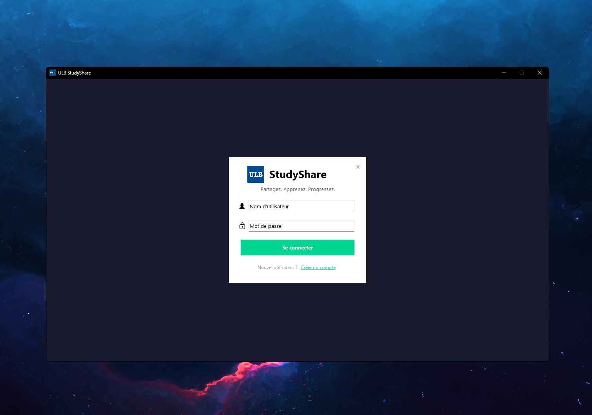
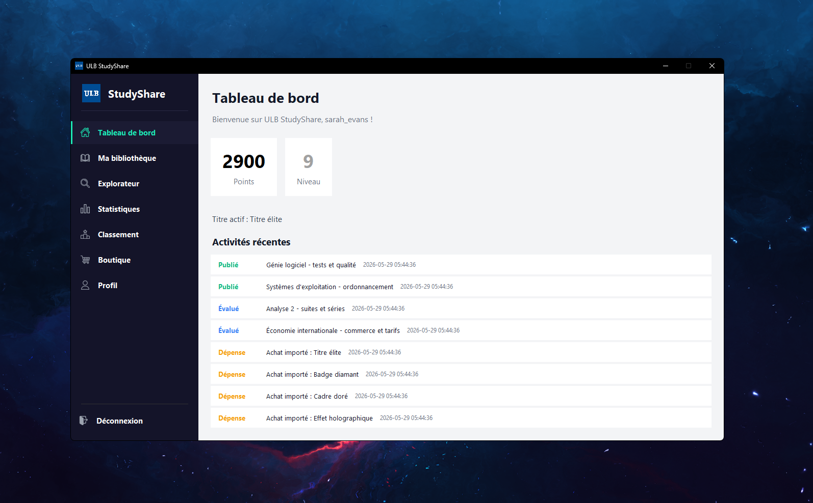
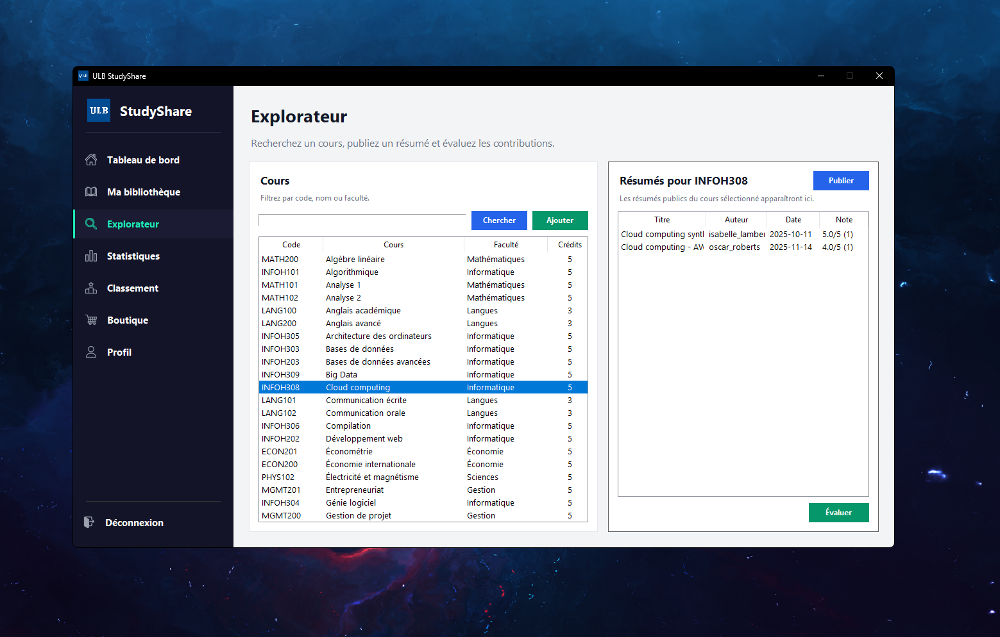
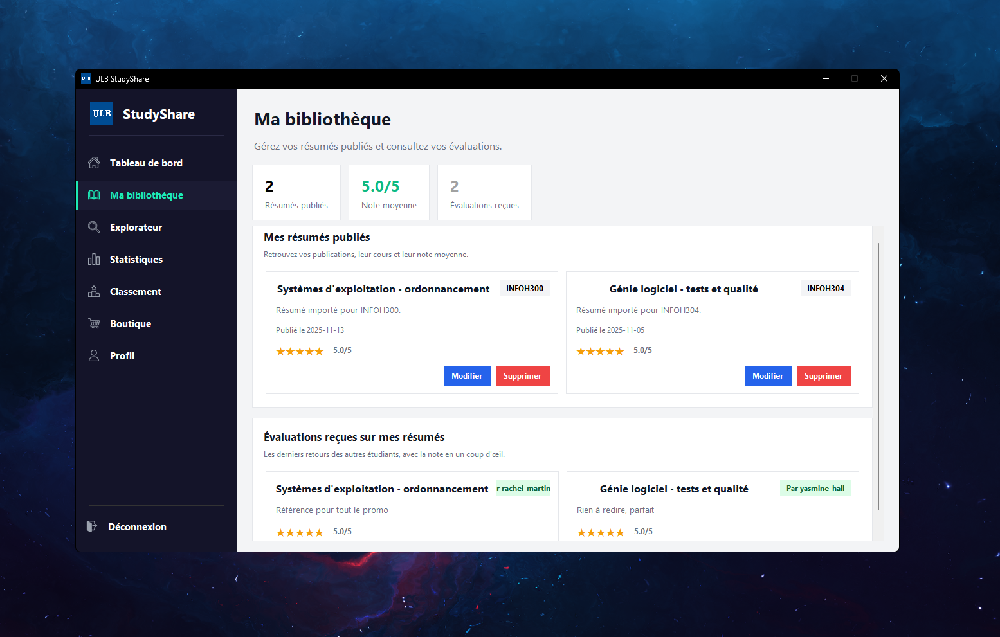
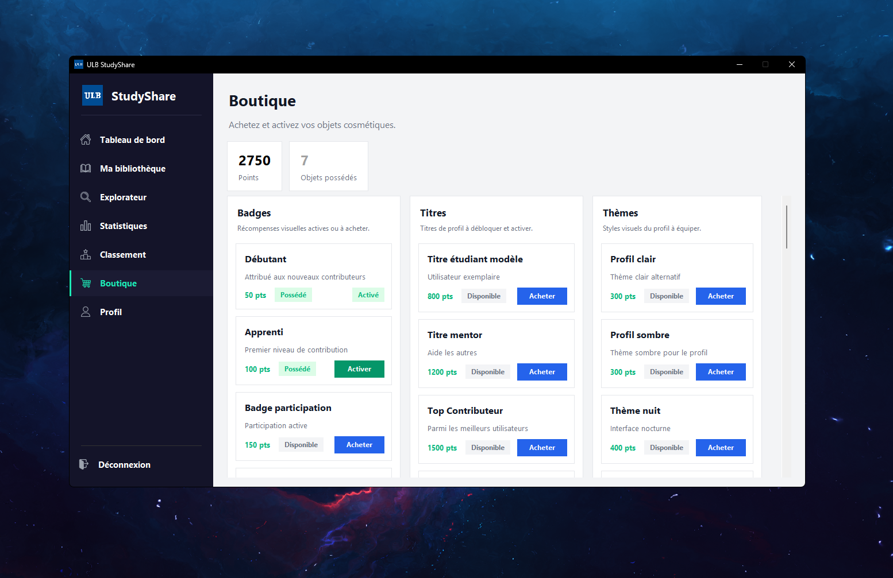
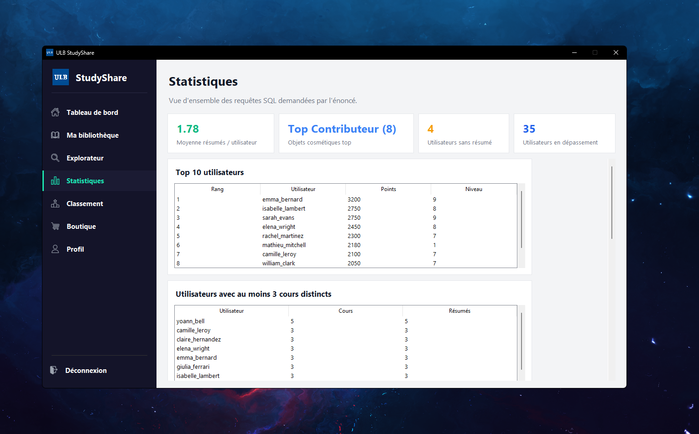

# ULB StudyShare


ULB StudyShare est une application de **partage de résumés de cours entre étudiants**, développée en **Python avec Tkinter et MySQL**. Consultez le catalogue de cours, publiez vos résumés et évaluez les contributions des autres étudiants.

L’application propose une bibliothèque personnelle, un classement, des points et une boutique d’objets cosmétiques. Une vue de statistiques complète l’exploration des données, importées depuis des fichiers CSV, XML et JSON.

> Projet académique ULB — INFO-H303.
> Bases de données

---

<a id="captures-decran"></a>

## 📸 Captures d’écran

| Connexion                                  | Tableau de bord                                      | Explorateur                                     |
|--------------------------------------------|------------------------------------------------------|-------------------------------------------------|
|  |  |  |

| Bibliothèque                                    | Boutique                                 | Statistiques                                       |
|-------------------------------------------------|------------------------------------------|----------------------------------------------------|
|  |  |  |

---

## 📖 Sommaire

- [Fonctionnalités](#fonctionnalites)
- [Prérequis](#prerequis)
- [Configuration MySQL](#configuration-mysql)
- [Installation et lancement](#installation-et-lancement)
- [Jeu de données](#jeu-de-donnees)
- [Architecture](#architecture)
- [Flux général](#flux-general)
- [Problèmes fréquents](#problemes-frequents)
- [Documents remis — Phase 2](#documents-remis-phase-2)

---

<a id="fonctionnalites"></a>

## ✨ Fonctionnalités

- **Authentification** : inscription, connexion et déconnexion via une interface graphique.
- **Tableau de bord** : résumé du profil, points, niveau, titre actif et activités récentes.
- **Explorateur de cours** : recherche de cours, consultation des résumés associés et ajout de nouveaux cours.
- **Publication de résumés** : ajout d'un résumé pour un cours et une année académique.
- **Évaluations** : note de 1 à 5 et commentaire sur les résumés publics, avec attribution de points à l'auteur.
- **Ma bibliothèque** : consultation, modification et suppression des résumés publiés par l'utilisateur connecté.
- **Boutique** : achat et activation d'objets cosmétiques : badges, titres et thèmes de profil.
- **Classement** : affichage des meilleurs contributeurs selon leurs points.
- **Statistiques** : vue dédiée aux requêtes SQL demandées par l'énoncé du projet.
- **Import automatique** : chargement des cours, utilisateurs, résumés, objets et évaluations depuis les fichiers de `data/`.

---

<a id="prerequis"></a>

## 🧰 Prérequis

- **Python 3.10 ou supérieur**
- **MySQL Server** lancé en local ou accessible depuis la machine
- **pip** pour installer les dépendances Python
- **Tkinter** pour l'interface graphique
  - inclus par défaut avec Python sous Windows ;
  - sous Linux, installer si nécessaire `python3-tk`.

Dépendances Python utilisées :

- `python-dotenv` : chargement du fichier `.env`
- `mysql-connector-python` : connexion à MySQL
- `Pillow` : chargement et traitement des images/icônes dans l'interface

---

<a id="configuration-mysql"></a>

## ⚙️ Configuration MySQL

1. Copier le fichier d'exemple :

```bash
cp .env_example .env
```

2. Adapter les variables selon votre installation MySQL :

```env
DB_USER=root
DB_PASSWORD=root
DB_HOST=localhost
DB_PORT=3306
DB_NAME=ULBStudyShareDB
```

3. Vérifier que le serveur MySQL est démarré et que l'utilisateur configuré peut créer une base de données.

Le script `schema.sql` crée la base `ULBStudyShareDB` si elle n'existe pas, puis crée les tables, contraintes et déclencheurs nécessaires.

---

<a id="installation-et-lancement"></a>

## ▶️ Installation et lancement

Depuis la racine du projet, installer les dépendances :

```bash
python3 -m pip install --upgrade pip
python3 -m pip install -r requirements.txt
```

### Premier lancement avec import des données

```bash
python3 main.py --init
```

Cette commande :

1. exécute `schema.sql`,
2. vide les tables importées,
3. importe les données de `data/`,
4. affiche les statistiques d'import dans le terminal,
5. lance l'interface graphique.

Attention : `--init` remet à zéro les tables liées au jeu de données avant de réimporter les fichiers.

### Lancement normal

```bash
python3 main.py
```

Cette commande exécute le schéma SQL si nécessaire puis lance directement l'application Tkinter, sans réimporter les données.

### Commandes rapides

```bash
# Installer les dépendances
python3 -m pip install -r requirements.txt

# Lancer avec réimport du jeu de données
python3 main.py --init

# Lancer sans réimport
python3 main.py
```

---

<a id="jeu-de-donnees"></a>

## 🗃️ Jeu de données

Les fichiers de données sont stockés dans `data/` et sont importés par `core/importers/service.py`.

| Fichier | Format | Rôle | Volume actuel |
| --- | --- | --- | --- |
| `data/cours.csv` | CSV | Catalogue des cours : code, nom, faculté, crédits | 47 cours |
| `data/recompenses.xml` | XML | Objets cosmétiques de la boutique : badges, titres, thèmes | 45 objets |
| `data/utilisateurs` | XML | Utilisateurs, résumés, achats, objets actifs | 50 utilisateurs, 90 résumés |
| `data/commentaires.json` | JSON | Évaluations et commentaires sur les résumés | 94 évaluations |

---

<a id="architecture"></a>

## 🧱 Architecture

Le projet suit une organisation en couches :

- `gui/` gère l'interface Tkinter, les vues et la navigation.
- `core/services/` contient la logique métier appelée par les contrôleurs.
- `core/repository/` regroupe les requêtes SQL.
- `core/models/` définit les objets de transfert utilisés par les vues.
- `core/importers/` transforme les fichiers de `data/` en insertions SQL.
- `core/parsers/` fournit les parseurs CSV, JSON et XML.
- `core/db/` centralise la configuration, la connexion et l'initialisation SQL.

```text
ULB-StudyShare/
├── assets/
│   ├── images/                    # Logo ULB et icônes de navigation
│   └── screenshots/               # Captures présentées dans ce README
│
├── core/
│   ├── auth/                      # Validation des champs connexion/inscription
│   ├── db/                        # Connexion MySQL, paramètres, exécution du schéma
│   ├── importers/                 # Import CSV/XML/JSON vers MySQL
│   ├── models/                    # Dataclasses et DTO métier
│   ├── parsers/                   # Parseurs de fichiers
│   ├── repository/                # Accès SQL par domaine
│   └── services/                  # Logique métier
│
├── data/
│   ├── commentaires.json          # Évaluations
│   ├── cours.csv                  # Catalogue de cours
│   ├── recompenses.xml            # Objets cosmétiques
│   └── utilisateurs               # Utilisateurs et résumés
│
├── docs/
│   ├── consignes/                 # Énoncés du projet
│   └── remise/                    # Documents de remise
│
├── gui/
│   ├── controllers/               # Contrôleurs login/workspace
│   ├── views/
│   │   ├── auth/                  # Écrans connexion/inscription
│   │   ├── common/                # Thème et sidebar
│   │   └── workspace/             # Tableau de bord, explorateur, boutique, etc.
│   ├── app.py                     # Création de la fenêtre Tkinter
│   ├── controller.py              # Contrôleur principal
│   ├── messages.py                # Dialogues utilisateur
│   ├── transitions.py             # Transitions visuelles
│   ├── ui_helpers.py              # Helpers UI/assets
│   └── ui_setup.py                # Configuration de la fenêtre
│
├── .env_example                   # Exemple de configuration DB
├── main.py                        # Point d'entrée CLI + GUI
├── requirements.txt               # Dépendances Python
└── schema.sql                     # Schéma MySQL, contraintes et déclencheurs
```

---

<a id="flux-general"></a>

## 🧬 Flux général

```text
main.py
  ├── exécute schema.sql
  ├── option --init : importe data/
  └── gui.app.run()
        └── AppController
              ├── AuthController
              ├── WorkspaceController
              └── services -> repositories -> DBManager -> MySQL
```

---

<a id="problemes-frequents"></a>

## ❗ Problèmes fréquents

### `Access denied for user`

Vérifier `DB_USER`, `DB_PASSWORD`, `DB_HOST` et `DB_PORT` dans `.env`.  
L'utilisateur MySQL doit pouvoir créer et modifier la base `ULBStudyShareDB`.

### `Can't connect to MySQL server`

Vérifier que MySQL est lancé. Sous Windows, contrôler le service MySQL depuis l'application Services ou depuis votre outil MySQL habituel.

### Données de démonstration absentes

Relancer l'import :

```bash
python3 main.py --init
```

---

<a id="documents-remis-phase-2"></a>

## 📄 Documents remis — Phase 2

Les documents de remise de la phase 2 sont disponibles dans `docs/remise/phase-2/` :

- [Entité-Association et Modèle relationnel — actualisé](docs/remise/phase-2/Entité-Association_et_Modèle-relationnel_ACTUALISÉ.pdf)
- [Requêtes](docs/remise/phase-2/Requêtes.pdf)
- [Slides](docs/remise/phase-2/Slides.pdf)
